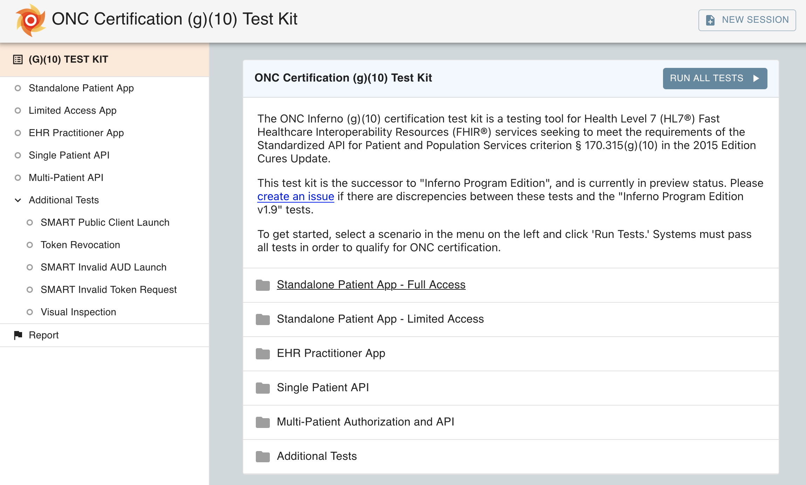

# Inferno Framework
{: .fs-9 }

Everything you need to create, execute and share tests for health IT systems
providing HL7® FHIR® standard APIs.
{: .fs-6 .fw-300}

[Get started now](/inferno-core/getting-started){: .btn .btn-primary .fs-5 .mb-4 .mb-md-0 .mr-2 } [Read the Docs](/inferno-core/overview){: .btn .fs-5 .mb-4 .mb-md-0 .mr-2 } [View it on GitHub](https://github.com/inferno-framework/){: .btn .fs-5 .mb-4 .mb-md-0 .mr-2 }

Simple to Read, Simple to Write
{: .fs-7 .fw-300 }
Inferno tests are written in a Ruby DSL, with a focus on readability. 
Inferno provides tools for easily testing FHIR APIs, including robust support for FHIR Resource validation.
{: .fs-4 }

```ruby
test do
  title 'Server returns requested Patient resource from the Patient read interaction'
  description %(
        Verify that Patient resources can be read from the server.
      )

  input :patient_id
  # Named requests can be used by other tests
  makes_request :patient

  run do
    fhir_read(:patient, patient_id, name: :patient)

    assert_response_status(200)
    assert_resource_type(:patient)
    assert resource.id == patient_id,
           "Requested resource with id #{patient_id}, received resource with id #{resource.id}"
  end
end
```

A Web UI, Out of the Box
{: .fs-7 .fw-300 }
Inferno ships with a web based user interface suitable for local use or deploying as a shared, central service.


Create, Share, Extend
{: .fs-7 .fw-300 }
Inferno Test Kits can be easily shared and extended so you can focus on your unique tests.
{: .fs-4 .d-flex .flex}
```ruby
require 'smart_app_launch_test_kit'

module MyTestKit
  class MyTestSuite < Inferno::TestSuite
    group from: :smart_discovery
  end
end
```

HL7, FHIR and the FHIR [FLAME DESIGN] are the registered trademarks of Health
Level Seven International and their use does not constitute endorsement by HL7.
{: .fs-2}
